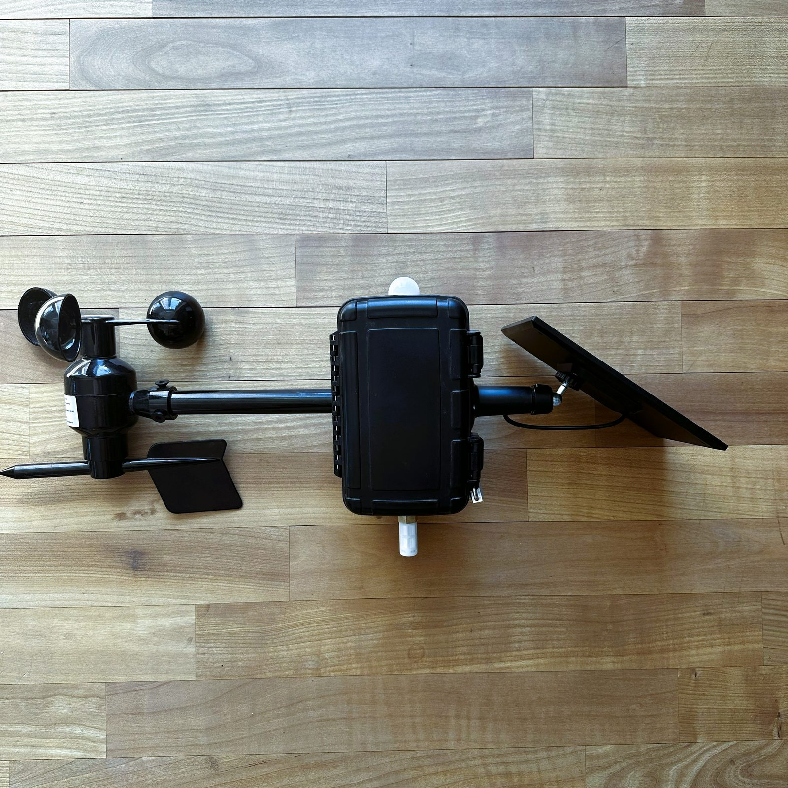
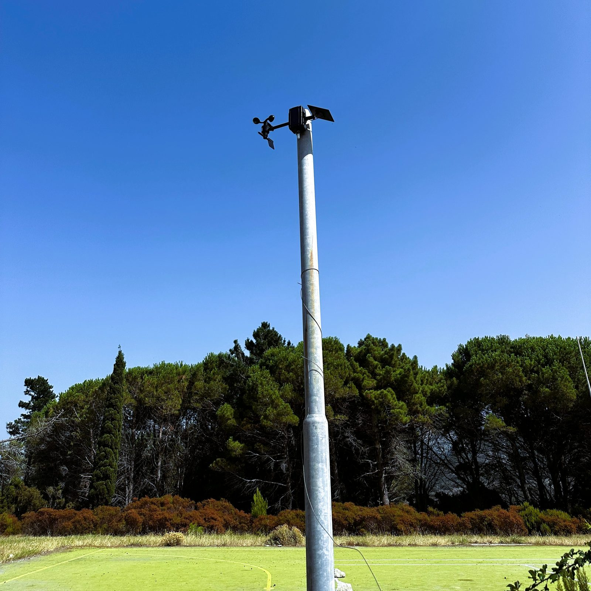
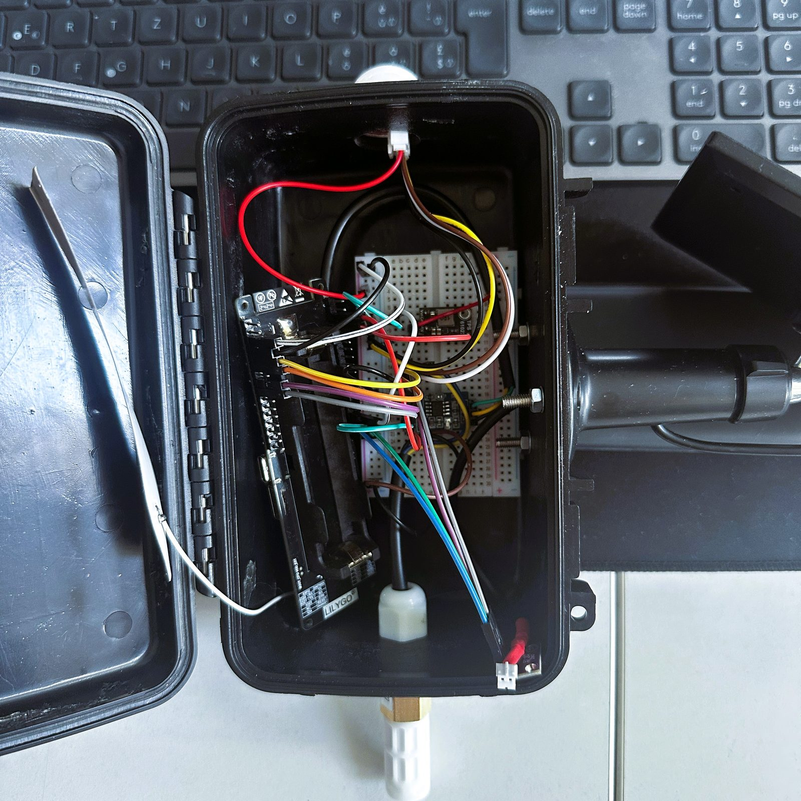
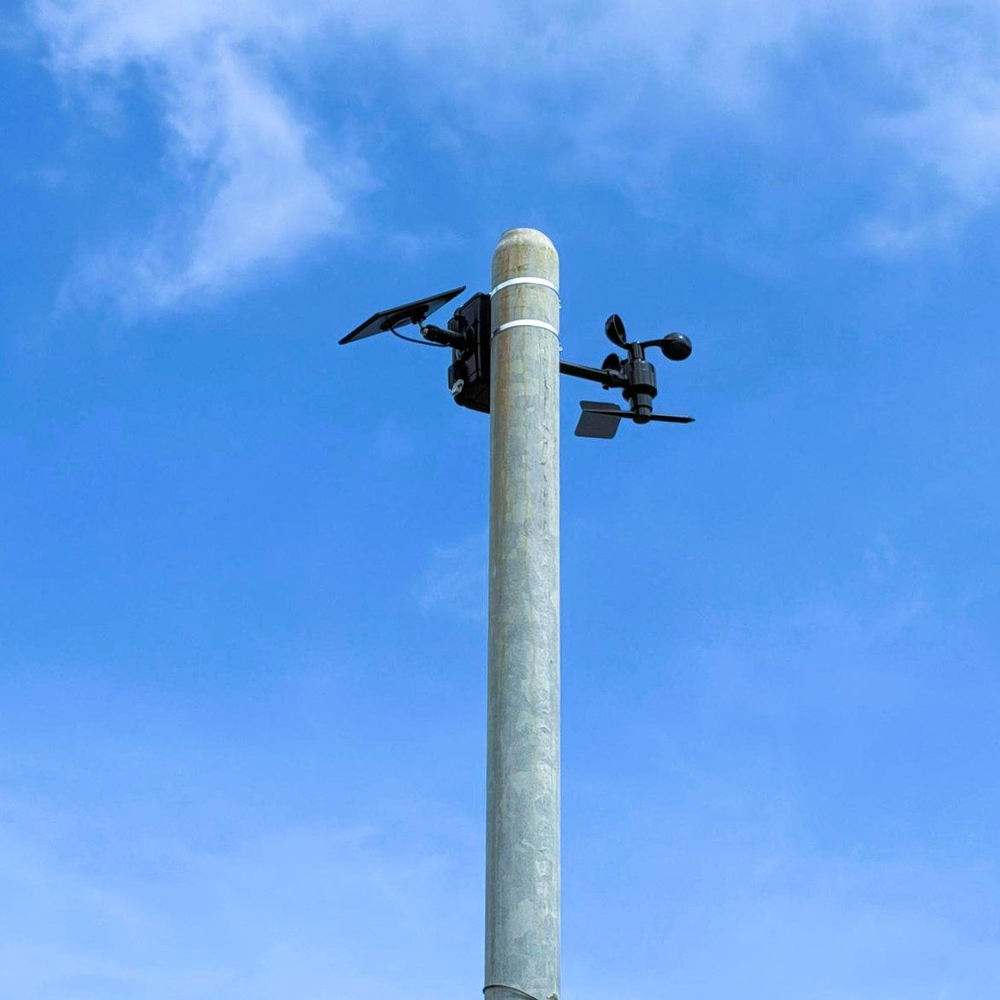

# Weather Station

A solar-powered ESP32 weather station built to answer a concrete question
for a local feasibility study: is the wind at a disused tennis court site on
Elba, Italy calm enough, often enough, to justify reinstating the court.

## Overview

Locals report the site can get quite windy, which matters for a court with
an otherwise excellent view — before the local municipality invests in
rebuilding it, this project collects a season's worth of real, on-site
weather data to inform that decision, rather than relying on anecdote.

The station runs on a LilyGo TTGO T-SIM7000G (ESP32 + LTE/GSM modem) with
four sensors — a BME280 inside the enclosure, an SHT20 and BH1750 outside,
and an RS485 Modbus wind/direction sensor — logging to SD card and running
off a small solar panel through a boost converter. Instead of waking on a
fixed interval, it computes local sunrise/sunset and spreads a configurable
number of daily readings across daylight hours, which matters for a
solar-only power budget. The bundled dashboard includes a configurable
playability check (wind and temperature thresholds) to turn logged readings
into a day-by-day, and eventually season-by-season, playability verdict.

| | |
|---|---|
|  |  |
| Assembled unit — wind/direction sensor, sensor enclosure, solar panel | Mounted on-site, overlooking the disused court on Elba |
|  |  |
| Internal wiring — ESP32, sensor breakout boards | Close-up of the mounted sensor head |

A separate firmware variant sends a daily SMS status update over 2G — which
works where 2G is still live (Italy) and won't work where it's been shut
down (e.g. Switzerland, since 2020/2021) — with a no-SMS build for
deployments where that's not viable.

## Tech stack

- **Firmware**: C++ / Arduino framework, ESP32 (LilyGo TTGO T-SIM7000G)
- **Sensors**: BME280, SHT20, BH1750 (I2C), XS-WSDS01 wind sensor (RS485
  Modbus-RTU via MAX485) — Modbus polling is hand-rolled rather than a
  library dependency
- **Connectivity**: SIM7000G modem via TinyGSM, for SMS status only
- **Storage**: SD card, CSV logging
- **Tools**: Python (schedule simulator), a static HTML/JS dashboard using
  Chart.js, with client-side CSV parsing and no backend

## How it works

See [`docs/architecture.md`](docs/architecture.md) for the full breakdown —
sunrise/sunset scheduling, power modes, the Modbus wind read, SD logging
format, and the SMS/2G constraint.

## Getting started

**Firmware**

1. Assemble the hardware per [`hardware/bill-of-materials.md`](hardware/bill-of-materials.md)
   and the wiring table in the header comment of
   [`firmware/weather_station_full/weather_station_full.ino`](firmware/weather_station_full/weather_station_full.ino).
2. In Arduino IDE, install: Adafruit BME280 Library (+ Adafruit Unified
   Sensor), SHT2x (Rob Tillaart), BH1750 (Christopher Laws), TinyGSM
   (vshymanskyy, only needed for the SMS build).
3. Pick a firmware variant — `firmware/weather_station_full/` (SD logging +
   SMS status) or `firmware/weather_station_no_sms/` (SD logging only,
   lighter dependency footprint) — and set `STATION_MODE`, `STATION_LAT`/
   `STATION_LON`, and (for the SMS build) `SMS_TARGET` at the top of the
   `.ino` file for your deployment.
4. Flash, insert the SD card, and power from the solar panel or USB for
   bench testing.

Individual sensor bring-up sketches used during development are in
[`firmware/prototypes/`](firmware/prototypes/).

**Tools**

- `python tools/measurement_schedule.py` previews the day's scheduled wake
  times for the configured location, without touching hardware.
- Open [`tools/dashboard_demo.html`](tools/dashboard_demo.html) directly in
  a browser for an instant look at the dashboard, preloaded with a
  synthetic 200-day sample dataset.
- Open [`tools/weather_dashboard.html`](tools/weather_dashboard.html) and
  drag a logged `weather.csv` onto it to view your own data — everything
  runs client-side, nothing is uploaded anywhere.

## Project structure

```
firmware/
  weather_station_full/     firmware with SD logging + SMS status
  weather_station_no_sms/   same, without the modem/SMS path
  prototypes/               single-sensor bring-up sketches
hardware/                   bill of materials, wind sensor manual
tools/
  measurement_schedule.py   sunrise/sunset schedule simulator
  weather_dashboard.html    CSV viewer / dashboard
  dashboard_demo.html       same dashboard, preloaded with sample data
data/                       sample logged data for the dashboard
docs/architecture.md        design notes
```

## Status / roadmap

Deployed and actively logging on-site on Elba, Italy. The plan is to let it
collect data through roughly a full season — into the start of next
season — before analyzing wind/temperature patterns against the
playability thresholds to inform the court decision. Known limitation, not
a bug: the SMS status feature depends on 2G coverage and simply doesn't
work in regions that have shut 2G down.

## License

MIT — see [`LICENSE`](LICENSE).
